# 05 — Sequence Diagrams

## 1. Registration

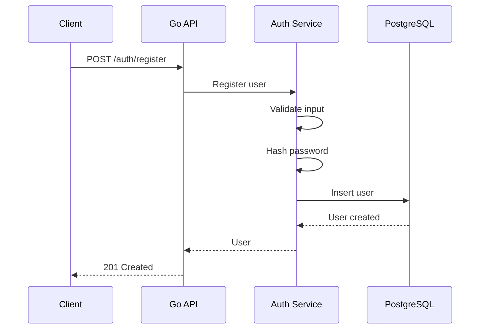

## 2. Login

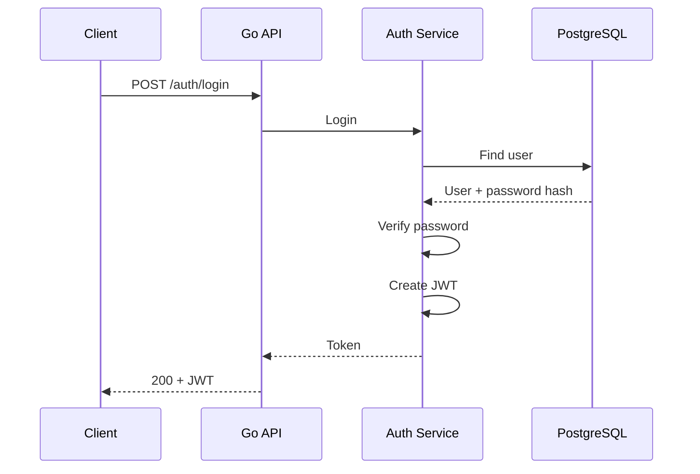

## 3. Authenticated Request

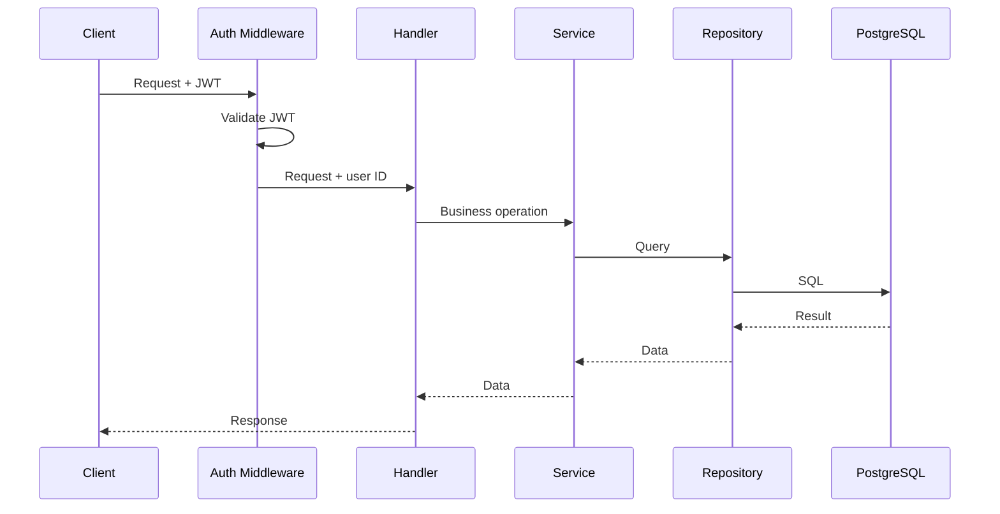

## 4. Create Application

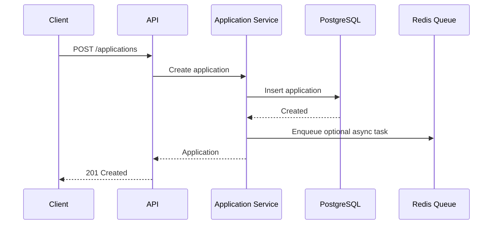

## 5. Background Job

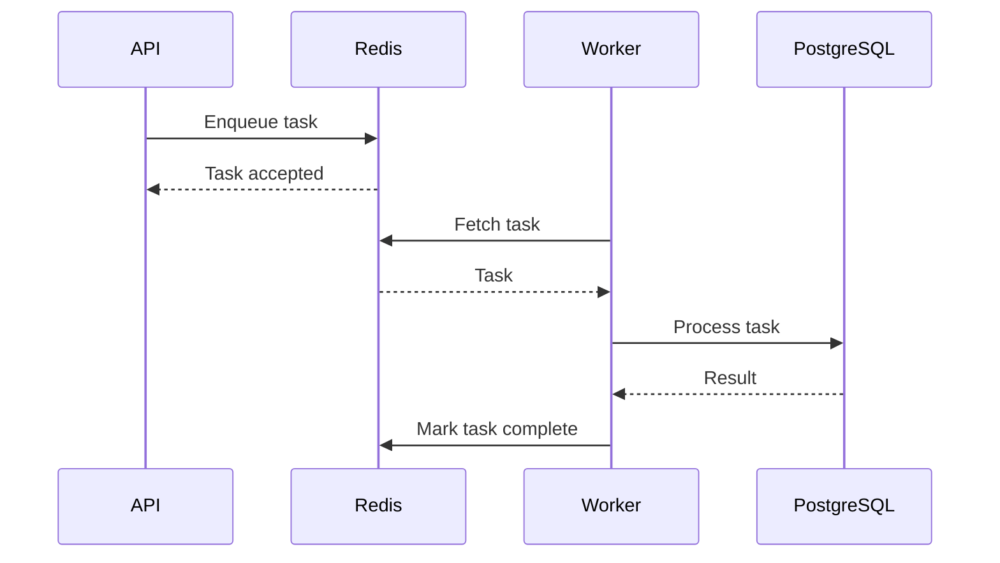

## 6. Failed Job

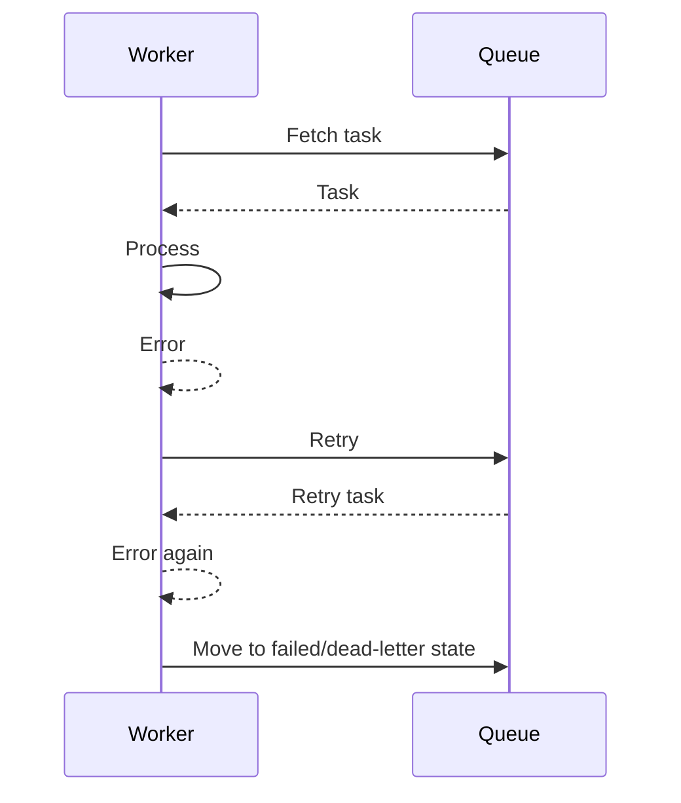

## 7. Cache Read

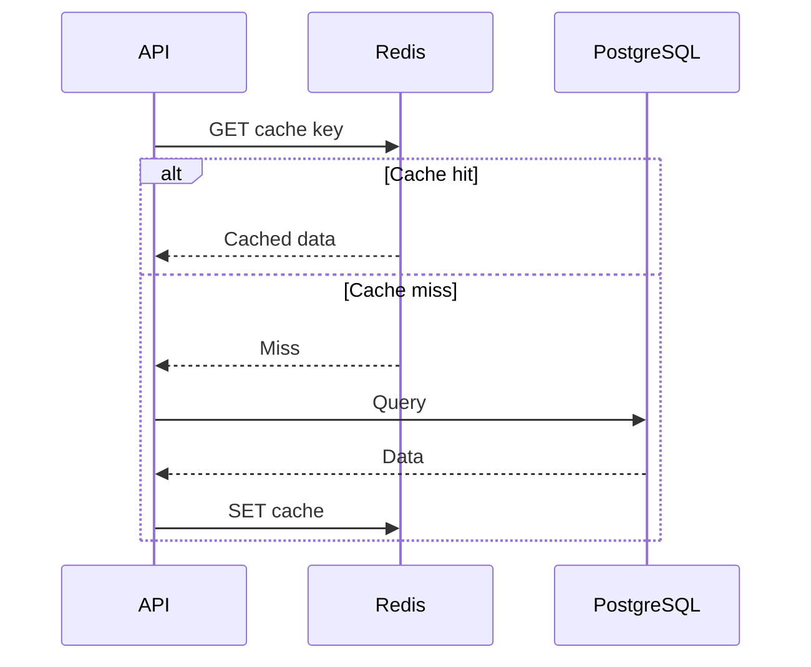

## 8. Cache Invalidation

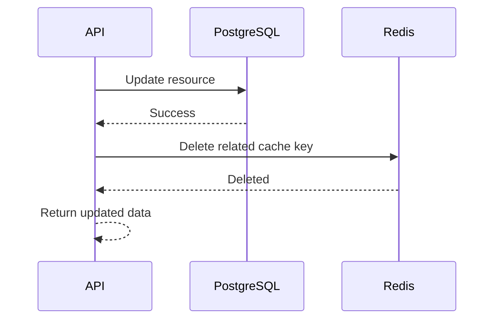

## 9. File Upload

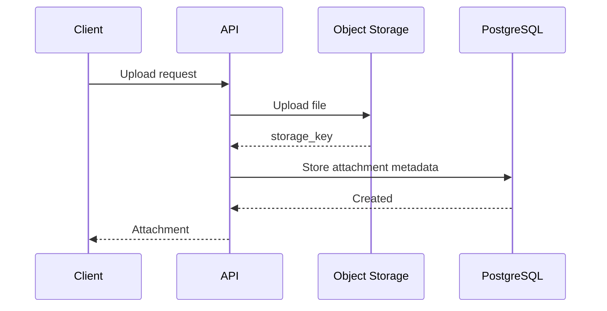

## 10. Rate Limiting

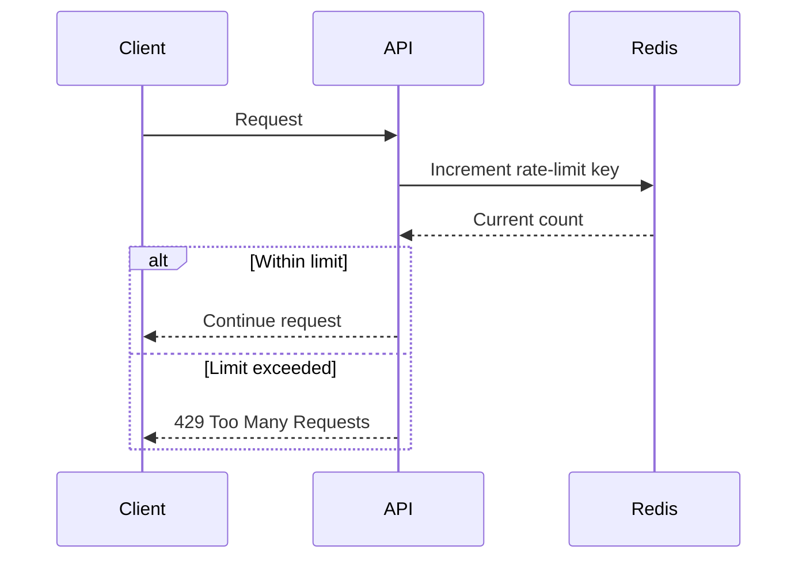

## 11. Readiness

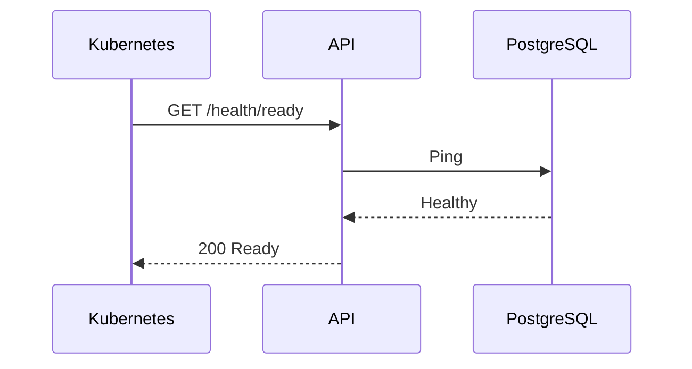

## 12. Graceful Shutdown

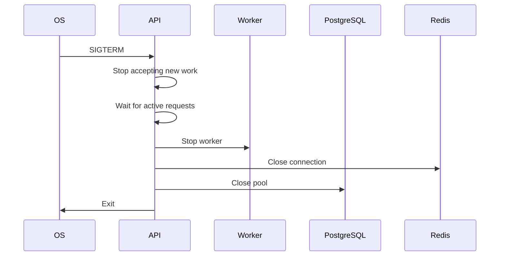
